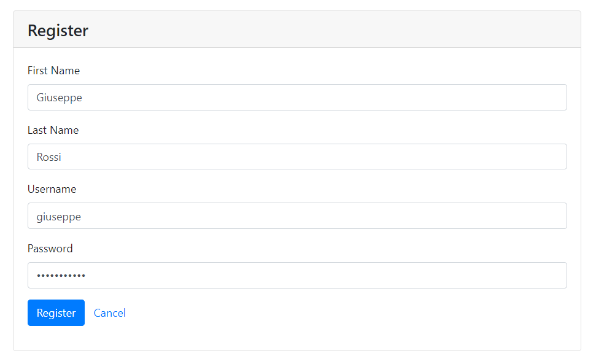
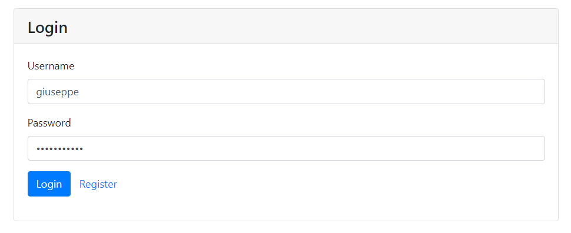
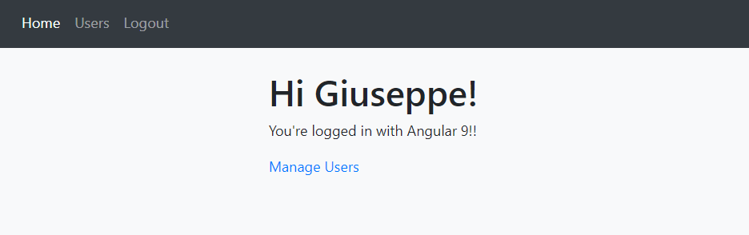
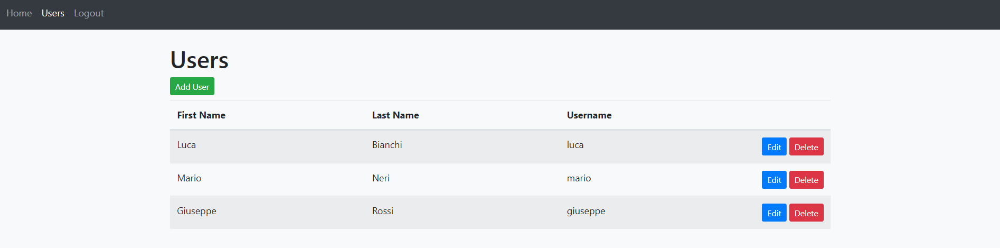

# angular-9-registration-login-example

## Summary

This project depends by [be-node-mongo-registration-login-api](https://github.com/sacob0ne/be-node-mongo-registration-login-api) project, so deploy it first locally and then deploy this project.

## Test service locally with docker-compose

### Prerequisites
1. [Docker](https://docs.docker.com/get-docker/)
2. [docker-compose](https://docs.docker.com/compose/install/)

If you want to test service locally, launch the following command:

```
docker-compose up -d --build
```

The command above will run Angular service as Docker container.

## How it works

1. Go to http://localhost:4200 .

2. Register an user as in the example below:



3. Login with user previously created:



4. You'll see a page just like this:



5. Go to `Users` section, in order to manage users:



6. If you want to log out, click on `Logout` section.


## Check data on MongoDB database

If you want to check that data have been inserted or removed correctly, launch following commands into MongoDB's container, created by [be-node-mongo-registration-login-api](https://github.com/sacob0ne/be-node-mongo-registration-login-api) project:

```bash
$ docker exec -it mongo /bin/bash

$ mongo mongodb://localhost:27017/replicaSet=rs0

> use node-mongo-registration-login-api

> db.users.find()
{ "_id" : ObjectId("60fd1086f694750013fe5e42"), "firstName" : "Francesco", "lastName" : "Verdi", "username" : "marco", "createdDate" : ISODate("2021-07-25T07:19:34.831Z"), "hash" : "$2a$10$choSzHV5uj4RGO7vdvZlCO2pfrAYzyjJcZ5UB.ObwaRCN9aDwIPqy", "__v" : 0 }
{ "_id" : ObjectId("60fd1161f694750013fe5e43"), "firstName" : "Luca", "lastName" : "Bianchi", "username" : "luca", "createdDate" : ISODate("2021-07-25T07:23:13.617Z"), "hash" : "$2a$10$j7Q.8v13P7LyCxM5i5UBceMH23aBQSppgDDyMV6oeBQU/BbxUxawq", "__v" : 0 }
```